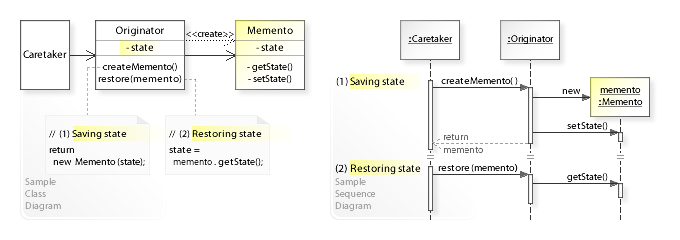

Also known as **Token**.

# Intend

As stated in [_GoF_, p283](https://fr.wikipedia.org/wiki/Design_Patterns) :
> Without violating encapsulation, capture and externalize an object's internal state so that the object can be restored to this state later.

**That is, create a safe save-state/checkpoint**

You should use the _Memento_ pattern in the following cases :
 - You want to be able to restore a previous state of an object without exposing the details of its implementation.
 - When the existing interface (getters/setters/fields...) of the object would expose implementation details and break its encapsulation.

# How it's done

This is actually pretty straight-forward !

Instead of trying to invade the private space of your objects to copy their states, just delegate creating/restoring snapshots to the actual owner of the state !

As a result, the object creates a _Memento_ object that hides its content from any other class, except the one that produced it.

Note : You can sill provide _Memento_ with a basic interface so that other classes can access its metadata for example, but nothing that would allow to actually modidy its content.

**Participants**

 - _Memento_ :
   - Stores internal state of the _Originator_ object.
   - May expose an interface to access some metadata of the snapshot.
   - Protects against access by objects other than the _Originator_.
 - _Originator_ :
   - Creates a _Memento_ containing a snapshot of its current state.
   - Uses the _Memento_ to restore itself to a previous state.
 - _CareTaker_ :
   - Is responsible for the _Memento_ safekeeping.
   - Never operates on or examines the contents of a _Memento_.

**How to implement**

 1. **Create** the _Memento_ class with the set of fields you need to mirror the _Originator_ object.
 2. **Make** the _Memento_ class immutable ( do not provide any setter or any other way to modify its fields than its constructor ).
 3. Optionally, you can **Nest** the _Memento_ into the _Originator_ object.
 4. **Provide** _Memento_ with methods to create _Mementos_ and restore its state from a given _Memento_.
 5. **Create** your _Caretaker_ and provide it with a way to know when requesting new _Mementos_ and when restoring an _Originator_.

Note : UML class diagram taken from [**here**](https://upload.wikimedia.org/wikipedia/commons/3/38/W3sDesign_Memento_Design_Pattern_UML.jpg)

# Pros & cons

**Pros**

 - **Preserves encapsulation**
 - **Simplifies** _Originator_ by letting the _Caretaker_ maintain the history of its state.

**Cons**

 - Might become **memory consuming** if too many _Mementos_ are created, or if _Mementos_ are heavy.
 - **Hidden costs** in carring for _Mementos_ - The _CareTaker_ is responsible for managing _Mementos_ lifecycles, but he has no idea how much state is in the _Mementos_.

Note : Unless encapsulating and restoring _Originator_ state is cheap, you might not want to use the _Memento pattern_.

# Notes

Here are some _usefull ressources_ :
 - [**w3sdesign**](http://w3sdesign.com/#gf)
 - A [**Refactoring guru**](https://refactoring.guru/design-patterns/memento) article.
 - A complete example [**here**](http://www.vishalchovatiya.com/memento-design-pattern-in-modern-cpp/)