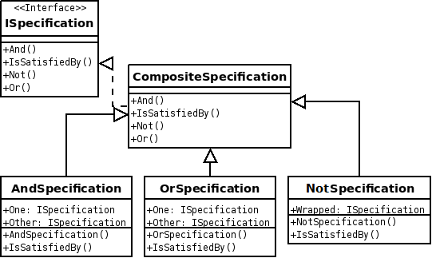

# Intend

**Implement boolean logic** to check whether objects meet certain requirements.

Use this in the following cases :
  - You want to **test objects by multiple criteria** using boolean logic.
  - You need to be able to **combine the criteria**.
  - You do **not have access** to the implementation of the objects you want to test.

Note : In these situations, you cannot implement the criteria by hand because of the combination factor that would create an explosion of classes.

# How it's done

**Participants**

 - _ISpecification_ : Templated Interface that declares the _isSatisfiedBy(T)_ method.
 - _CompositeSpecification_ : _Composite nodes_ for the **AND**, **OR** and **NOT** operators. 
 - _ConcreteSpecification_ : _Leaf elements_ for the various kind of tests that can be composed.

Note : UML class diagram taken from [**here**](https://upload.wikimedia.org/wikipedia/commons/8/8b/Specification_UML_v2.png)

# Pros & cons

**Pros**

 - **Opened/Closed** principle: It is easy to introduce new conditions and tests without duplicating code.
 - **Very flexible** : Possibility of combining criterias to perform various tests without many specialized classes.
 - **Logic** : Supports logical operations, which produces easy-to-read code.

**Cons**

 - **Complex** : Must invest in complex framework.

# Notes

 - An article by [**Eric Evans and Martin Fowler**](https://www.martinfowler.com/apsupp/spec.pdf)
 - An [**complete article**](https://ademcatamak.medium.com/specification-design-pattern-c814649be0ef) illustrating the use of the pattern.
