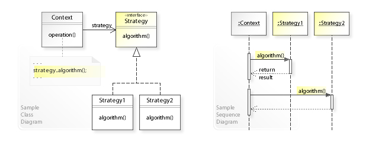

Also known as **Policy**.

# Intend

As stated in [_GoF_, p315](https://fr.wikipedia.org/wiki/Design_Patterns) :
> Define a family of algorithms, encapsulate each one, and make them interchangeable. Strategy lets the algorithm vary independently from clients that use it.

You should use the _Strategy_ pattern in the following cases :
 - You need to use several algorithms with different variations.
 - You want to be able to change the algorithm at run-time.
 - You want to eliminate several conditional statements for algorithms decisions.
 - You have a lot of similar classes that only differ in the way they execute some behaviour.

# How it's done

**Participants**

 - _Context_
   - Is configured with a _ConcreteStrategy_ object.
   - Maintains a reference to that object.
 - _Strategy_
   - Declares an interface common to all algorithms.
 - _ConcreteStrategy_
   - Implements the algorithm using the _Strategy_ interface.

**How to implement**

 1. **Identify** an algorithm that is prone to frequent change.
 2. **Declare** the _Strategy_ interface that aggregates common parts (high-level behaviour) of every algorithms ( _ConcreteStrategy_ ).
 3. **Implement** every algorithm in its own _ConcreteStrategy_ class.
 4. **Add a field** to store a reference to a _ConcreteStrategy_ object In the _Context_ class. Provide the client with a setter to replace that field.
 5. **That it it !** The client should now associate its _Context_ with the _ConcreteStrategy_ it needs and get the job done.

Note : UML class diagram taken from [**here**](https://upload.wikimedia.org/wikipedia/commons/4/45/W3sDesign_Strategy_Design_Pattern_UML.jpg)

# Pros & cons

**Pros**

 - **Alternative to subclassing** : Subclassing can achieve the same goal (i.e. support a variety of behaviors) but hard-wires them into _Context_, which make that _Context_ harder to understand and maintain.
 - **Improves readability** by eliminating conditional code for _Concretestrategies_ (algorithms).
 - **Single responsability principle** : One class by strategy.
 - **Open/closed principle** : It is easy to add new _ConcreteStrategies_ without breaking any code or any need to change existing code.

**Cons**

 - The client should have some knowledge on the differences between the _ConcreteStrategies_ to be able to select the one it needs.

# Notes

Here are some _usefull ressources_ :
 - [**w3sdesign**](http://w3sdesign.com/#gf)
 - A [**Refactoring guru**](https://refactoring.guru/design-patterns/strategy) article.
 - A complete example [**here**](http://www.vishalchovatiya.com/strategy-design-pattern-in-modern-cpp/)
