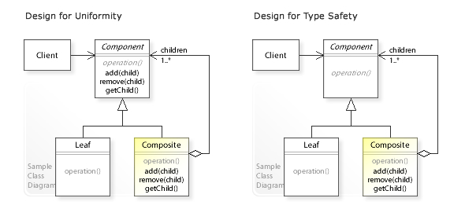

# Intend

**Compose objects** into tree structures to represent part-whole hierarchies.

It **lets clients treat individual objects and compositions uniformly**.

You should use the _Composite_ pattern in the following cases :
 - The core model of your app can be **represented as a tree**.
 - You want (or you want the Client) to perform operations on composite objects as if they were standard objects - that is interacting with them using a **common interface**.

# How it's done

**Participants**

 - _Component_ : 
   - Declares the **interface** for the objects in the composition.
   - Implements the **default behaviour** for the **common interface** to all classes.
   - Declares an **interface** for **managing childs components**.
 - _Leaf_ : 
   - An object of the composition that has no children.
   - Defines the **default behaviour** of **primitive objects**.
 - _Composite_ :
   - Defines behaviour for components having children.
   - **Stores** the child components.
   - Implements the **child-related operations** in the _Component_ interface.
 - _Client_ : Manipulates the objects in the composition through the _Component_ interface.

**How to implement**

 1. **Make sure** the model of your app can be represented as a Tree.
 2. **Declare** the _Component_ interface with the methods that make sense for both _Leafs_ and _Composites_.
 3. **Create** _Leaf_ classes to represent simple elements that do not have children.
 4. **Create** _Composite_ classes with an underlying container for children, methods to add/remove children. 
 5. **Implement** the _Component_ methods in the _Composite_ delegating the hard work to children.

Note : UML class diagram taken from [**here**](https://upload.wikimedia.org/wikipedia/commons/3/39/W3sDesign_Composite_Design_Pattern_Type_Safety_UML.jpg)

# Pros & cons

**Pros**

 - You and your clients can work easily with complex structures.
 - **Open/Closed principle**: It is easy to introduce new elements in the apps without breaking the existing code.
 - Reduce code complexity by eliminating many loops over the homogeneous collection of objects.

**Cons**

 - It might be difficult to provide a common interface for classes whose functionality differs too much. In certain scenarios, you’d need to overgeneralize the component interface, making it harder to comprehend.

# Notes

Here are some _usefull ressources_ :
 - A great article on [**Source making**](https://sourcemaking.com/design_patterns/composite)
 - A [**blog article**](http://www.vishalchovatiya.com/composite-design-pattern-in-modern-cpp/) showing an example using [**CRTP**](https://en.wikipedia.org/wiki/Curiously_recurring_template_pattern)
 - A [**Refactoring guru**](https://refactoring.guru/design-patterns/composite) article.