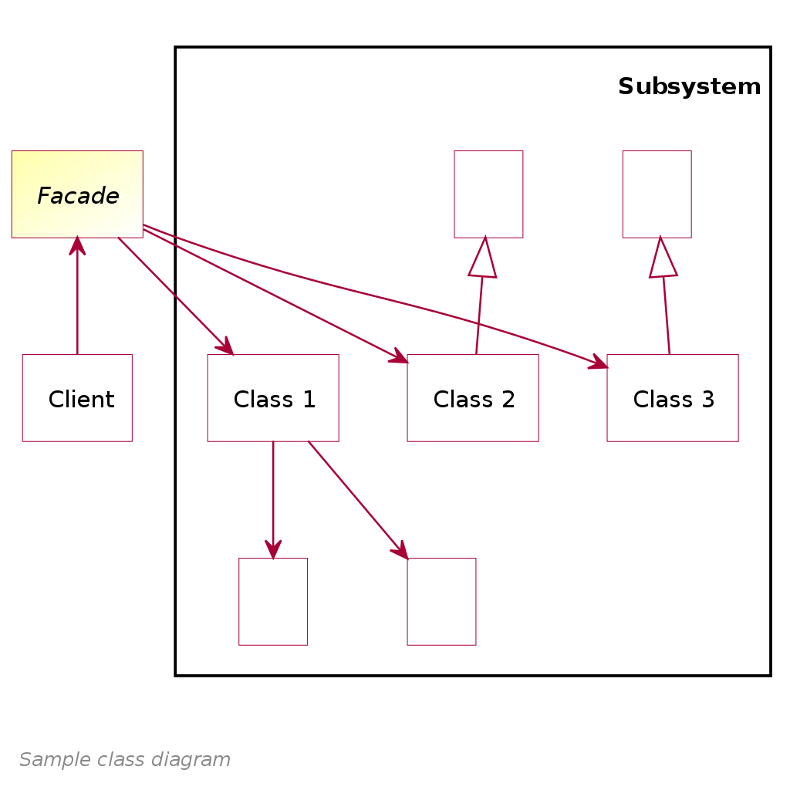

# Intend

Provide a **unified interface to a set of interfaces in a subsystem**.

The _Facade_ pattern defines a **higher-level interface** that makes the subsystem easier to use.

You should use the _Facade_ pattern in the following cases :
 - You want to provide a **simple interface to a complex system**.
 This way, you will provide your clients with a default view of the subsystem that is enough for their needs.
 - You want to avoid **tight coupling** between your client and the objects of the subsystem.
 - You want to **layer your subsystems**.

# How it's done

**Participants**

 - _Facade_ : 
   - High-level interface that knows which subsystem is responsible for each possible requests.
   - **Delegates** all the hard-work to the appropriate subsystem object.
 - _Subclass systems_ :
   - The classes that implement subsystem functionalities.
   - Do the work assigned by the _Facade_ object.
   - **Have no knowlegde about the _Facade_** - They do not keep any reference to it.

Note : A _Facade_ object can often be implemented as a [**_Singleton_**](../singleton/README.md) since only 1 is needed in most cases.

**How to implement**

This is pretty straight-forward :)

 1. **Declare and implement** the interface of the _Facade_ class.
   - Keep in mind this _Facade_ should delegate the calls from the _client_ to the appropriate objects in the subsystem.
   - It should be responsible for _initializing the subsystem_ and _managing its cycle of life_ (unless the _Client_ already does that, which seems unlikely.)
 2. **Make sure** the _client_ exclusively communicates with subsystem using the _Facade_.
 3. If the _Facade_ grows too much, consider extracting part of its behaviour to a new _RefinedFacade_ class.

Note : UML class diagram taken from [**here**](https://upload.wikimedia.org/wikipedia/commons/thumb/1/13/Facade_Design_Pattern_Class_Diagram_UML.svg/1024px-Facade_Design_Pattern_Class_Diagram_UML.svg.png)

# Pros & cons

**Pros**

 - **Decouples clients from subsystem** :  Clients are decoupled from the subsystem and work through the _Facade_ object. They only know about the simple _Facade_ interface and are independent of the complex subsystem (loose coupling). 
 - **Decouples subsystems**

**Cons**

 - A facade can become a **god object** coupled to all classes of an app.
 - The _client_ only gets to use what is defined in the _Facade_ interface, so it might become uncapable of using the subsystems at their best if the _Facade_ is poorly defined.

# Notes

Here are some _usefull ressources_ :
 - The [**w3sdesign**](http://w3sdesign.com/?gr=s05&ugr=proble) is really clear and concise. (NB : sample code in Java)
 - A [**blog article**](http://www.vishalchovatiya.com/facade-design-pattern-in-modern-cpp/) with an example.
 - A [**Refactoring guru**](https://refactoring.guru/design-patterns/facade) article.